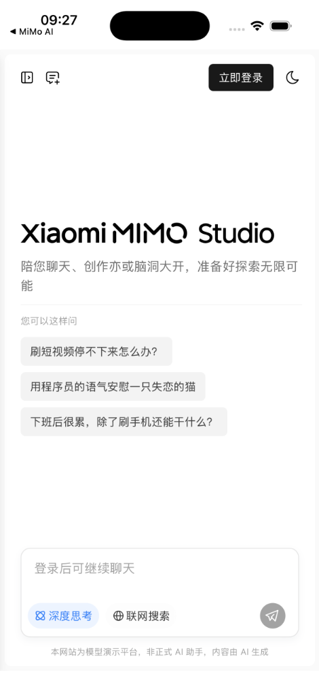
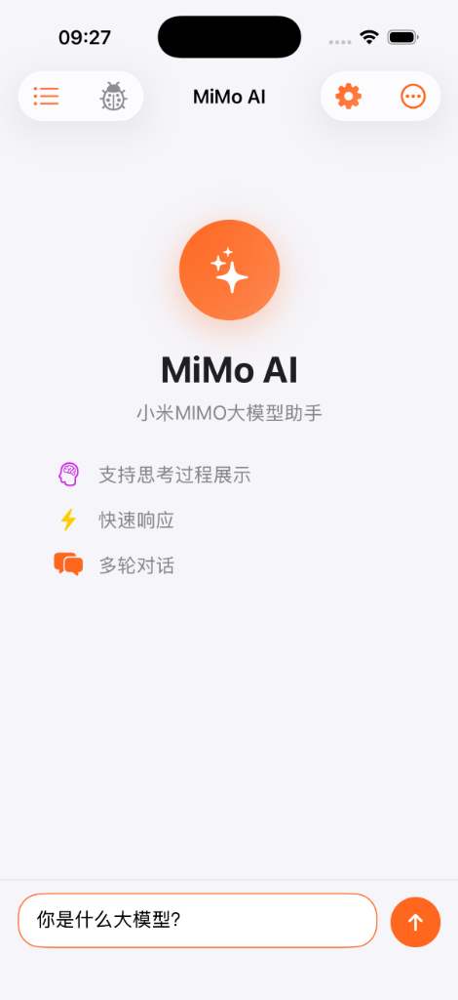

# MiMo AI iOS

[English](#english) | [中文](#中文)

---

<a name="english"></a>
## 🇺🇸 English

Native iOS clients for Xiaomi MiMo AI. Choose your preferred version:

| Version | Description | API Key Required |
|---------|-------------|------------------|
| [📱 WebView](./WebView/) | Loads MiMo Studio directly | ❌ No |
| [🔑 API](./API/) | Custom API integration | ✅ Yes |

### Screenshots

<p align="center">
  
  
</p>

---

## 📱 WebView Version

The easiest way to use MiMo AI. No API key needed!

```bash
cd WebView
brew install xcodegen
xcodegen generate
open MiMoAI.xcodeproj
```

---

## 🔑 API Version

Full control with your own API key. Customizable settings.

1. Get your API Key at [platform.xiaomimimo.com](https://platform.xiaomimimo.com)
2. Build and run:
```bash
cd API
brew install xcodegen
xcodegen generate
open MiMoChat.xcodeproj
```
3. Enter your API Key in Settings ⚙️

---

## Related Projects

- [MiMoMac](https://github.com/ibigbigip/MiMoMac) - macOS Desktop Client

---

<a name="中文"></a>
## 🇨🇳 中文

小米 MIMO 大模型 iOS 客户端。选择您喜欢的版本：

| 版本 | 说明 | 需要 API Key |
|------|------|--------------|
| [📱 WebView 版](./WebView/) | 直接加载 MiMo Studio | ❌ 不需要 |
| [🔑 API 版](./API/) | 自定义 API 集成 | ✅ 需要 |

### 截图

<p align="center">
  
  
</p>

---

## 📱 WebView 版

最简单的使用方式，无需 API Key！

```bash
cd WebView
brew install xcodegen
xcodegen generate
open MiMoAI.xcodeproj
```

---

## 🔑 API 版

使用自己的 API Key，完全可控，可自定义设置。

1. 在 [platform.xiaomimimo.com](https://platform.xiaomimimo.com) 申请 API Key
2. 编译运行：
```bash
cd API
brew install xcodegen
xcodegen generate
open MiMoChat.xcodeproj
```
3. 在设置 ⚙️ 中填写 API Key

---

## 相关项目

- [MiMoMac](https://github.com/ibigbigip/MiMoMac) - macOS 桌面版

---

## License

MIT License

## Acknowledgements

- Xiaomi MiMo Team for providing AI services
